## Key Learning Points

- End-to-end latency budget for a typical HFT round trip: 8-15 us total; any stage exceeding its allocation creates systemic delay
- Budget breakdown (greensheet targets): NIC DMA + kernel bypass ~1 us, parsing ~1 us, order-book update ~0.5 us, strategy ~1 us, OMS + FIX ~1.5 us, NIC transmit ~1 us
- Measurement methodology: hardware timestamps (PTP PHC) at wire, RDTSC at application boundaries, correlated via seqno
- Key insight: 1 microsecond of added latency costs ~100-1000 USD/month in lost alpha for a typical MM desk
- Each cache miss (LLC) adds ~100 ns, each context switch adds ~5 us, each syscall adds ~1-5 us
- Profiling tools: perf stat for hardware counters, bpftrace for kernel-boundary tracing, RDTSC for in-process sampling
- Tail latency: p99 = p50 * 2-3x in well-tuned systems; p99.9 = p50 * 5-10x; monitor p99.9 for outlier events
- Headroom: keep stage utilisation below 70% to avoid queuing delay amplification (Little's Law: queue_depth = utilisation / (1 - utilisation))

```mermaid
graph LR
    RX["NIC RX + DMA<br/>~1.0 μs"] --> KP["Kernel Bypass<br/>~1.5 μs"]
    KP --> Parse["Protocol Parse<br/>~1.0 μs"]
    Parse --> Book["Order-Book Update<br/>~0.5 μs"]
    Book --> Strat["Strategy Logic<br/>~1.0 μs"]
    Strat --> OMS["OMS + FIX Encode<br/>~1.5 μs"]
    OMS --> TX["NIC TX<br/>~1.0 μs"]
    TX --> Result["Total: ~7.5 μs<br/>Greensheet: 6.0 μs"]

    style RX fill:#1e40af,color:#fff
    style KP fill:#1e3a5f,color:#93c5fd
    style Parse fill:#2e1f6e,color:#a5b4fc
    style Book fill:#3b1f6e,color:#c4b5fd
    style Strat fill:#5b1f3e,color:#f9a8d4
    style OMS fill:#5b2a1f,color:#fdba74
    style TX fill:#92400e,color:#fde68a
    style Result fill:#047857,color:#fff
```



```html
<div class="ad-wrapper">
  <div class="ad-title">Latency Budget — Tick to Trade Waterfall</div>
  <div class="ad-flow">
    <div class="ad-stage active"><span class="ad-stage-icon">📡</span><span class="ad-stage-label">Wire Rx</span></div>
    <div class="ad-arrow"><span class="material-symbols-outlined">chevron_right</span><span class="ad-packet"></span></div>
    <div class="ad-stage"><span class="ad-stage-icon">🔄</span><span class="ad-stage-label">Kernel Bypass</span></div>
    <div class="ad-arrow"><span class="material-symbols-outlined">chevron_right</span><span class="ad-packet"></span></div>
    <div class="ad-stage"><span class="ad-stage-icon">📊</span><span class="ad-stage-label">Feed Handler</span></div>
    <div class="ad-arrow"><span class="material-symbols-outlined">chevron_right</span><span class="ad-packet"></span></div>
    <div class="ad-stage"><span class="ad-stage-icon">🧠</span><span class="ad-stage-label">Strategy</span></div>
    <div class="ad-arrow"><span class="material-symbols-outlined">chevron_right</span><span class="ad-packet"></span></div>
    <div class="ad-stage"><span class="ad-stage-icon">📨</span><span class="ad-stage-label">Order Entry</span></div>
    <div class="ad-arrow"><span class="material-symbols-outlined">chevron_right</span><span class="ad-packet"></span></div>
    <div class="ad-stage"><span class="ad-stage-icon">🔌</span><span class="ad-stage-label">Wire Tx</span></div>
  </div>
</div>
```

## Usage

```cpp
// Latency measurement with hardware timestamps
#include <time.h>
#include <linux/net_tstamp.h>
#include <sys/socket.h>

struct LatencyBudget {
    // Target nanoseconds per stage
    static constexpr uint64_t NIC_RX     = 1000;   // 1 us
    static constexpr uint64_t PARSE      = 1000;   // 1 us
    static constexpr uint64_t BOOK_UPDATE = 500;    // 0.5 us
    static constexpr uint64_t STRATEGY   = 1000;   // 1 us
    static constexpr uint64_t OMS_FIX    = 1500;   // 1.5 us
    static constexpr uint64_t NIC_TX     = 1000;   // 1 us
    static constexpr uint64_t TOTAL      = 6000;   // 6 us (greensheet)

    static void report(uint64_t measured_ns, uint64_t budget_ns,
                       const char* stage) {
        double ratio = static_cast<double>(measured_ns) / budget_ns;
        if (ratio > 1.0) {
            fprintf(stderr, "OVER BUDGET: %s %.1f us (budget %.1f us, x%.1f)\n",
                    stage, measured_ns / 1000.0, budget_ns / 1000.0, ratio);
        }
    }
};

// RDTSC-based stage timer
static inline uint64_t rdtscp() {
    uint32_t lo, hi;
    asm volatile("rdtscp" : "=a"(lo), "=d"(hi) :: "ecx");
    return ((uint64_t)hi << 32) | lo;
}

struct StageTimer {
    const char* name_;
    uint64_t budget_ns_;
    uint64_t tsc_hz_ = 2.6e9;  // measure at init via /proc/cpuinfo
    uint64_t start_ = rdtscp();
    ~StageTimer() {
        uint64_t elapsed_cycles = rdtscp() - start_;
        uint64_t elapsed_ns = elapsed_cycles * 1'000'000'000 / tsc_hz_;
        LatencyBudget::report(elapsed_ns, budget_ns_, name_);
    }
};
```

## Source Code

```cpp
// Hardware timestamping on receive
// recvmsg with SO_TIMESTAMPING flag returns
// hardware timestamp in cmsg ancillary data
struct msghdr msg = {};
struct iovec iov = {buf, len};
msg.msg_iov = &iov;
msg.msg_iovlen = 1;
char ctrl[64];
msg.msg_control = ctrl;
msg.msg_controllen = sizeof(ctrl);

recvmsg(sock, &msg, 0);
struct cmsghdr* cmsg = CMSG_FIRSTHDR(&msg);
// Search for SCM_TIMESTAMPING_OPT_STATS to get hw timestamp
```
