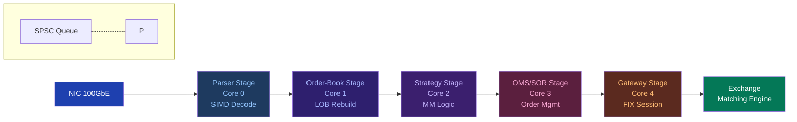

## Key Learning Points

- HFT systems decompose into pipelined stages: market data feed -> parser -> order book -> strategy -> OMS -> SOR -> FIX engine -> exchange gateway
- Each stage runs on a dedicated core with its own thread and lock-free queues between them
- Market data stage: one thread per exchange feed (e.g., CME A, CME B, Eurex); pinned to NUMA node nearest the NIC
- Parser stage: SIMD-accelerated protocol parsing (FIX/ITCH/SBE); produces normalised internal order-book events
- Order-book stage: maintains per-symbol LOB; produces top-of-book, imbalance, and quote events for strategies
- Strategy stage: runs trading logic; subscribes to relevant symbols; produces order requests to OMS
- OMS/SOR stage: manages order lifecycle; routes orders to appropriate venues; tracks fill/partial/reject status
- Gateway stage: implements exchange-specific session logic; handles sequence numbers, resend requests, heartbeats
- Thread isolation: no shared mutable state between pipeline stages; data flows through SPSC queues
- Heartbeat/watchdog: each stage sends periodic liveness signals; monitoring alerts on missed heartbeats



## Usage

```cpp
// Pipeline architecture sketch
struct PipelineStage {
    virtual ~PipelineStage() = default;
    virtual const char* name() = 0;
    virtual void start() {
        thread_ = std::jthread([this](std::stop_token st) { run(st); });
        // Pin to dedicated core
        cpu_set_t cpuset;
        CPU_ZERO(&cpuset);
        CPU_SET(core_, &cpuset);
        pthread_setaffinity_np(thread_.native_handle(), sizeof(cpuset), &cpuset);
    }
    virtual void run(std::stop_token st) = 0;
    int core_ = -1;
    std::jthread thread_;
    SPSCQueue<Event, 65536>* input_{nullptr};
    SPSCQueue<Event, 65536>* output_{nullptr};
};

// Example: five-stage pipeline
// NIC -> Parser -> OrderBook -> Strategy -> OMS -> Gateway -> Exchange
// Each arrow is a lock-free SPSC queue
// Core assignment: 0=Parser, 1=OrderBook, 2=Strategy, 3=OMS, 4=Gateway
```

## Source Code

```cpp
// Parser stage skeleton
class ParserStage : public PipelineStage {
    const char* name() override { return "parser"; }
    void run(std::stop_token st) override {
        while (!st.stop_requested()) {
            Event evt;
            while (input_->pop(evt)) {
                // Parse raw packet, produce normalised event
                MktDataEvent mde = parseITCH(evt.raw_data, evt.len);
                output_->push(Event::fromMktData(mde));
            }
        }
    }
};

// Strategy stage subscribes to symbols
class StrategyStage : public PipelineStage {
    const char* name() override { return "strategy"; }
    void run(std::stop_token st) override {
        MarketMakingStrategy mm;
        while (!st.stop_requested()) {
            Event evt;
            while (input_->pop(evt)) {
                if (evt.type == EventType::TOP_OF_BOOK) {
                    auto signal = mm.onTopOfBook(evt.tob);
                    if (signal.action != Action::NONE) {
                        output_->push(Event::fromOrderRequest(signal.order));
                    }
                }
            }
        }
    }
};
```
