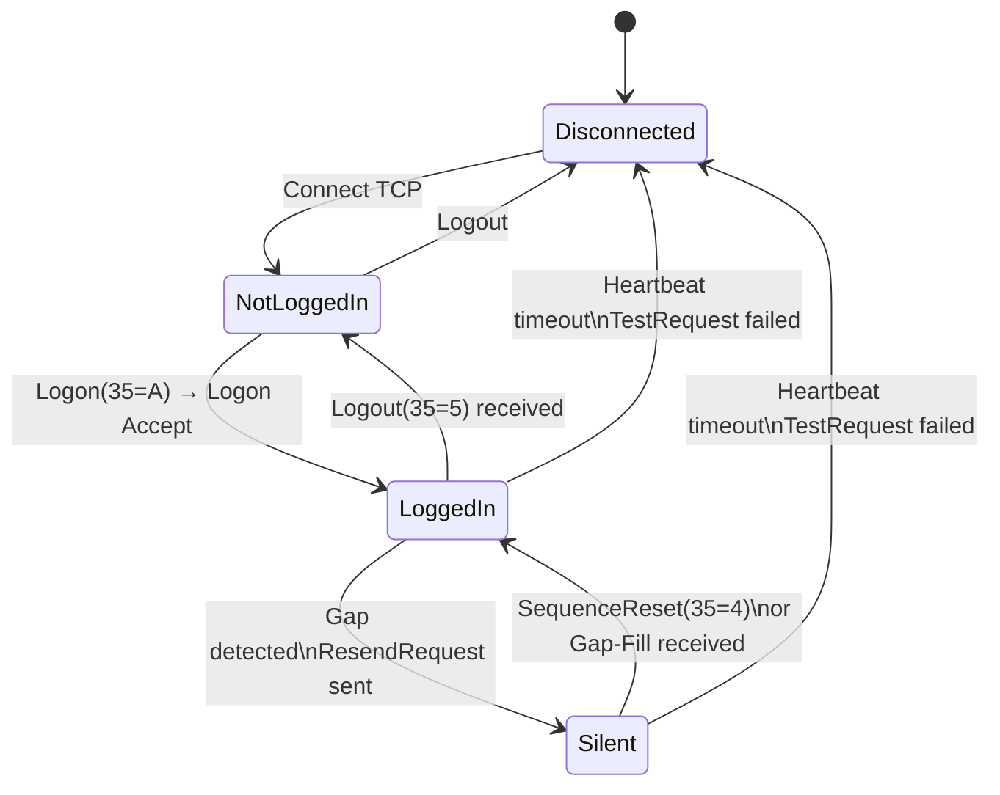

## Key Learning Points

- FIX session FSM: states are `NotLoggedIn`, `LoggedIn`, `Silent`, `Disconnected`, `WaitingForLogon`; transitions driven by Logon/Logout/Heartbeat/TestRequest messages
- Sequence number management: each session tracks `MsgSeqNum` inbound/outbound; gaps trigger `ResendRequest` (35=2); sender must reply with `SequenceReset` (35=4) or gap-fill
- Gap-fill logic: loss detected when received `MsgSeqNum > expected`; send `ResendRequest(beginSeqNo, endSeqNo)`; receive either `SequenceReset(GapFillFlag=Y)` or full message replay
- Logon negotiation: `EncryptMethod`, `HeartBtInt`, `DefaultApplVerID`, `Username/Password`; session-level vs application-level logon
- Message validation: `BodyLength` must match, `CheckSum` (tag 10) = mod 256 of all chars before tag 10, `BeginString` (tag 8) must match, `SenderCompID/TargetCompID` (tags 49/56)
- FIX-over-SBE: binary FIX (SBE-encoded) reduces wire size ~60% vs text FIX; FastPacket on CME iLink 3; SBE schema compiled from XML into C++ structs
- Session recovery: on reconnect, exchange expected `MsgSeqNum` from last session; if gap, logged-in side sends `ResendRequest`; never trade on stale state
- Heartbeat monitoring: missing `HeartBtInt * 2` triggers `TestRequest`; if no response within `HeartBtInt`, declare session lost and begin reconnect



```html
<div class="ad-wrapper">
  <div class="ad-title">FIX Session State Machine</div>
  <div class="ad-fsm">
    <span class="ad-state dim">Disconnected</span>
    <span class="ad-transition-arrow material-symbols-outlined">arrow_right_alt</span>
    <span class="ad-state active">Connected</span>
    <span class="ad-transition-arrow material-symbols-outlined">arrow_right_alt</span>
    <span class="ad-state">Logged On</span>
    <span class="ad-transition-arrow material-symbols-outlined">arrow_right_alt</span>
    <span class="ad-state">Session Up</span>
    <span class="ad-transition" style="margin:0 0.25rem">⇄</span>
    <span class="ad-state" style="border-color:#f59e0b">Recovery</span>
  </div>
</div>
```

## Usage

```cpp
// FIX session FSM event dispatch
enum class FixState { NOT_LOGGED_IN, LOGGED_IN, SILENT, DISCONNECTED };

struct FixSession {
    FixState state_ = FixState::DISCONNECTED;
    uint64_t expected_seq_in_ = 1;
    uint64_t next_seq_out_ = 1;

    void onMessage(const FixMsg& msg) {
        uint64_t seq = msg.getTag(34);
        if (seq > expected_seq_in_) {
            // Gap detected: request resend
            sendResendRequest(expected_seq_in_, seq - 1);
            state_ = FixState::SILENT;  // wait for gap-fill
        }
        // Process based on MsgType (35)
        switch (msg.getMsgType()) {
        case 'A':  // Logon
            validateLogon(msg);
            if (state_ == FixState::NOT_LOGGED_IN) {
                state_ = FixState::LOGGED_IN;
                expected_seq_in_ = seq + 1;
            }
            break;
        case '0':  // Heartbeat
            state_ = FixState::LOGGED_IN;
            break;
        case '4':  // SequenceReset
            handleSeqReset(msg);
            state_ = FixState::LOGGED_IN;
            break;
        case '5':  // Logout
            state_ = FixState::NOT_LOGGED_IN;
            break;
        }
    }

    void validateLogon(const FixMsg& msg) {
        // Check EncryptMethod (98), HeartBtInt (108), DefaultApplVerID (1137)
        // Verify SenderCompID (49) matches our config
        // Compute and verify CheckSum (10)
    }
};
```

## Source Code

```cpp
// Checksum calculation (FIX standard)
uint8_t computeFixChecksum(const char* buf, size_t len) {
    // Checksum covers all characters up to (but not including) tag 10=
    uint64_t sum = 0;
    for (size_t i = 0; i < len; ++i) {
        if (i + 6 <= len && strncmp(buf + i, "10=", 2) == 0)
            break;  // tag 10= found, sum before this
        sum += static_cast<uint8_t>(buf[i]);
    }
    return static_cast<uint8_t>(sum % 256);
}

// FIX-over-SBE message decoding (CME iLink 3)
struct SbeMessageHeader {
    uint16_t block_length_;
    uint16_t template_id_;
    uint16_t schema_id_;
    uint16_t version_;
    // Followed by SBE-encoded fields per template
    // Decode via generated C++ classes from SBE XML schema
};
```
