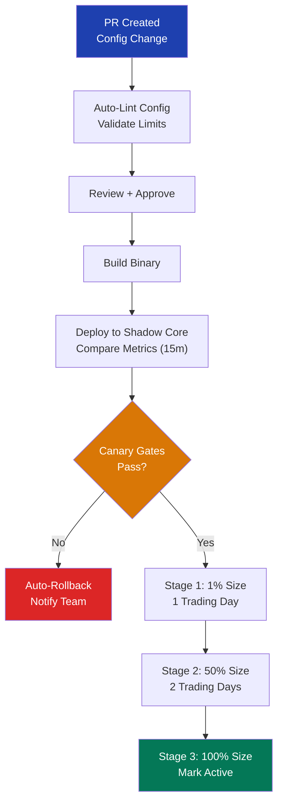

## Key Learning Points

- Strategy config as code: all strategy parameters (instruments, skew, size limits, aggressiveness) in YAML/JSON tracked in git; changes go through PR + review + approval pipeline
- Staged rollout: stage 0 = paper trading/simulation (1 day), stage 1 = tiny size (1-5% target, 1 day), stage 2 = half target (2 days), stage 3 = full; each stage requires sign-off
- P&L canary gates: after each stage, compare P&L attribution to baseline; if Sharpe ratio drops > 20% or max drawdown exceeds threshold, auto-rollback
- Feature flags: runtime-configurable boolean/float flags per strategy; control skew, participation rate, symbol inclusion without restart; flag changes logged to audit trail
- Config diff audit: every config change recorded with before/after diff; who, what, when, why; automated compliance check against trading limits
- Rollback procedures: `git revert` on config repo triggers deployment pipeline in reverse; rollback in < 30 seconds via feature flags; pre-staged rollback binaries
- Deployment topology: binary deployed to shadow core first (same feed), compare latency/P&L vs live; then promote to production core one by one



## Usage

```cpp
// Strategy config (YAML)
// strategy:
//   name: es-market-making
//   version: 1.4.2
//   instruments:
//     - symbol: ESH7
//       max_position: 50
//       skew: 0.2        # -1 to 1 (bearish to bullish)
//       participation: 0.1  # max 10% of venue volume
//   risk:
//     max_notional: 5000000
//     max_order_rate: 200   # per second
//   flags:
//     enable_auction_participation: false
//     aggressive_pricing:      true

// Canary gate evaluation
struct CanaryGate {
    struct Metrics {
        double sharpe_;
        double max_dd_bps_;
        double fill_rate_;
        double adv_sel_rate_;
    };
    Metrics baseline_, candidate_;
    bool passed() const {
        return candidate_.sharpe_ > baseline_.sharpe_ * 0.8 &&
               candidate_.max_dd_bps_ < baseline_.max_dd_bps_ * 1.2 &&
               candidate_.fill_rate_ > baseline_.fill_rate_ * 0.95;
    }
};

// Rollback via feature flag
// struct StrategyFlags {
//     std::atomic<bool> halt_trading_{false};     // immediate stop
//     std::atomic<double> max_skew_{1.0};         // runtime skew limit
// };
```

## Source Code

```cpp
// Deployment pipeline stages (CI/CD)
// 1. PR created → auto-lint config, validate limits
// 2. Review + approve → build binary
// 3. Deploy to shadow core → compare metrics (15 min)
// 4. If shadow passes → stage 1: 1% size (1 trading day)
// 5. Stage 2: 50% size (2 trading days)
// 6. Stage 3: 100% size → mark config as active
// 7. Any stage failure → auto-rollback + notify

// Config audit log format
// timestamp=2026-06-27T09:15:00Z
// user=kallol
// action=config_update
// strategy=es-market-making
// diff:
//   - param: es_market_making.skew
//     old: 0.2
//     new: 0.35
//   reason: "increased skew to match vol regime shift"
```
